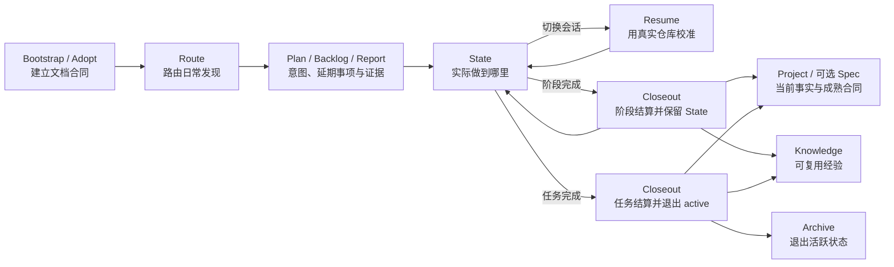

<div align="center">

# Project Memory

**让 Agent 记住项目，而不是被项目文档淹没。**

面向个人长期项目的轻量文档治理与跨会话记忆 Skill 包。

**Agent-agnostic core · Codex-ready package · Zero external runtime dependencies**

</div>

> 文档协同真正的问题通常不是“没有文档”，而是文档越来越多之后，Agent 再也无法判断哪一份仍然有效。

Project Memory 源于一个持续演进的个人项目：我们认真维护愿景、MVP、PRD、计划书、README 和 AGENTS，但随着实现不断修正，文档逐渐从帮助 Agent 的上下文，变成了干扰 Agent 的历史噪声。

这个插件不试图让 Agent 读取更多文档。它要解决的是：

> **此刻应该相信什么、当前任务做到哪里、下个会话如何继续，以及这次踩过的坑是否值得永远记住。**

## 你可能正在经历这些问题

### 同一个 MVP，出现了好几份“当前版本”

```text
MVP.md
MVP-v2.md
MVP-final.md
MVP-final-new.md
```

最初的愿景随着真实开发大幅变化，但旧 PRD、旧设计和新方案仍然并排存在。日期只能说明谁写得更晚，不能证明谁更权威。

### README 和 AGENTS 越写越像

README 塞入架构、路线、Agent 规则和历史说明后，人类很难快速了解项目；AGENTS 又复制一遍项目介绍，最终两边同时漂移。

### Plan 被迫承担进度、交接和历史

原计划在开发中不断遇到意外：接口变了、架构改了、测试暴露了遗漏。Agent 只好在计划书末尾持续打补丁。换一个会话后，新 Agent 既不知道原计划哪里已经失效，也不知道现实执行到了哪里。

### 长期任务跨会话后失忆

上下文快满了，但任务只完成了 40%。重新开会话时，要么重新解释全部背景，要么交给新 Agent 阅读几十页对话和多份计划，然后赌它能拼出正确现场。

### Bug 修了，经验却没有留下

完整调查报告很长，Git diff 又无法解释非直观根因。真正应该保留的经验没有稳定入口，相同的环境问题、错误假设和诱人失败路线会被 Agent 再踩一次。

### 执行中发现的问题和点子无处安放

一个小问题不影响当前验收，暂时也不值得写完整 Plan；一个优化点子刚刚出现，还没有排期。它们要么被硬塞进当前 State，要么留在聊天里消失，要么被扩写成维护成本过高的小计划书。

### Report 写了，但下个 Agent 不会主动读

Agent 知道 `reports/` 可以保存调查证据，却不知道何时值得创建，也不知道以后应该按哪些模块、路径或错误信号检索。报告最终变成了存在于目录里、却脱离工作流的历史文件。

### Knowledge 最终也变成垃圾场

如果所有 Bug、决定、失败和提醒都不断追加到一个文件，`KNOWLEDGE.md` 很快会成为下一份上下文炸弹。

### 重型治理框架解决了分类，却制造了维护负担

为个人项目提前建立完整 ADR、Change、Memory Bank、报告和归档体系，很容易变成“先搭结构，再强迫内容填进去”。目录看起来专业，实际却没有帮助 Agent 少犯错。

## Project Memory 的答案

Project Memory 不是一套固定文档目录，而是一条完整、可恢复的项目记忆生命周期：



它围绕七个设计原则工作。

### 1. 文档合同持续约束后续产出

初始化不是“创建几个文件就结束”。插件会建立一份项目级文档合同，明确：

- 什么信息应该放在哪里；
- 什么情况下才创建新文档；
- 当前文档与日期化文档如何命名；
- 哪些来源代表当前事实，哪些只是计划或证据；
- 阶段或任务完成后内容如何提升、保留、归档或删除。

后续 Agent 新建长期文档前必须先读取这份合同。因此不需要等文档再次失控后重新执行一次 adopt。

### 2. 按事件主动路由，不要求用户懂文档分类

Agent 在执行中发现延期问题、优化、技术债、点子、调查证据或候选经验时，主动判断：

```text
当前任务必须解决       → State
未排期的独立后续工作   → Issue / Backlog
已决定近期实施         → Plan
难以重建的调查证据     → Report
尚未成熟的可复用经验   → State 候选经验
已独立验收的成熟结论   → 转交 Closeout 做正式结算
代码、测试或 Git 已足够 → 不创建长期文档
```

Backlog 是可选的单一轻量入口，不是另一种 Plan。项目已有 Issue 系统时直接复用；当前任务必须完成的事项不能降级进去后宣布完成。

Report 也不按任务长短创建：只在调查、实验、迁移或根因证据未来难以从代码和 Git 重建时保存。修改高风险模块、遇到相似异常或事实冲突时，Agent 按模块、路径、符号、错误词和主题检索相关 Report，而不是默认吞入整个目录。

`route-project-memory` 是可选快捷入口，不是新的生命周期门禁。它只处理一个执行中发现：可以做最小写入或检索，但不会自行晋升 Spec/Knowledge，也不会归档 State；成熟结论统一转交 `closeout-project-task`。

### 3. 按信息性质分类，不迷信文件名

| 信息回答的问题 | 主要落点 |
| --- | --- |
| 项目现在是什么 | Project 或现有当前状态文档 |
| 本次任务准备满足什么 | Plan |
| 实施中实际确认或推翻了什么 | State |
| 哪些独立后续工作尚未排期 | Issue 或 Backlog |
| 哪项成熟合同需要跨任务独立维护 | Spec、Schema、测试或现有合同入口 |
| 当前任务实际做到哪里 | State |
| 调查发现了什么证据 | Report |
| 以后不能再踩什么坑 | Knowledge |
| 某个旧方案当时是什么 | Archive |

例如一份混合型 MVP 文档中的内容可能需要分别落位：

- 当前产品形态 → Project；
- 本次预期行为和实施步骤 → Plan；
- 实施中确认、推翻或待验证的规则 → State；
- 所属范围独立验收后仍需跨任务维护、且独立文档具有额外价值的合同 → Spec；
- 真实执行进度 → State；
- 被推翻的原始方案 → Archive。

### 4. Plan 和 State 永远不是一回事

```text
Plan  = 当时准备怎么做
State = 现在实际做到哪里
```

Plan 可以被现实推翻。State 必须反映代码、测试、Git diff、worktree 和运行证据。

Plan 可以包含任务级预期行为、初步接口和验收条件；State 只记录任务现实及其相对 Plan 的偏差，不再复制一份完整规格。若任务正在修改已有 Spec，旧 Spec 在完成态结算前仍代表当前正式行为。

同一个长期任务无论跨越多少会话，只维护一份反复压缩和重写的 `STATE.md`，不会产生：

```text
handoff-2.md
handoff-final.md
handoff-final-new.md
```

### 5. Resume 不盲信交接文档

State 是定位入口，不是绝对真相。恢复任务时会重新核对：

- 实际仓库和 worktree；
- 当前分支、HEAD 与 dirty state；
- State 之后的新提交和用户改动；
- 测试及运行证据是否仍然有效。

初始上下文不是阅读白名单。发现跨模块影响、冲突或新线索时，Agent 应根据证据继续扩大调查范围，而不是无差别吞入整个 `docs/`。

### 6. Knowledge 是提炼层，不是追加日志

任务进行中，可能有价值但尚未确认的发现只进入 State 的“候选经验”。

阶段或任务形成可独立验收结果后，只有满足以下条件的内容才会提升到 Knowledge：

- 根因不直观，未来容易误判；
- 很可能在其他任务、环境或版本中复发；
- 用户纠正了一个可复用的错误假设；
- 某条失败路线看起来合理，Agent 容易重新采用；
- 修改相关模块前必须理解其中原因。

完整日志和调查过程留在 Report；Knowledge 只保存高密度结论。写入前会搜索、合并重复条目；内容增长后才按领域拆分，并让 `KNOWLEDGE.md` 退化为短索引。

### 7. 文档体系随真实复杂度生长

项目开始时只建立真正需要的入口。没有第一条长期经验，就不创建空 Knowledge；没有跨会话任务，就不创建 State；代码、Schema 和测试已经充分表达合同，或合同尚未跨任务稳定，就不创建 Markdown Spec。

Spec 是成熟结论的毕业去向，不是任务要求的默认出生地。只有同时满足以下两项才创建或更新独立 Spec：

1. 所属的最小可独立验收范围完成后，仍被后续任务、多个模块、外部消费者、兼容或安全边界持续依赖；
2. 独立的人类可读文档比代码、Schema 和测试提供了额外的跨模块语义价值。

AGENTS 只保存 Agent 工作方式、文档路由和少量所有任务都必须知道的护栏，不复制完整产品、数据或接口合同。

> **先积累真实内容，再根据密度拆结构；不先建宫殿，再要求项目住进去。**

## 六个边界清晰的 Skill

| Skill | 触发条件 | 它负责什么 | 它不负责什么 |
| --- | --- | --- | --- |
| `bootstrap-project-memory` | 新项目或几乎没有长期文档 | 建立人类入口、Agent 路由、当前事实入口和持续文档合同 | 不提前创建空目录和空知识库 |
| `adopt-project-memory` | 已有文档杂乱、重复、漂移或权威冲突 | 接管现有文档地基，恢复现役入口并迁移旧材料 | 不把“第一阶段完成”冒充整个接管完成 |
| `route-project-memory` | 执行中说“记一下这个点子”“这个小 Bug 以后修”，或命中历史问题信号 | 为单个发现选择 State / Backlog / Plan / Report / Closeout / 无文档，并按信号检索证据 | 不自行晋升 Spec/Knowledge，不替代检查点或正式结算 |
| `checkpoint-project-task` | 未完成任务准备暂停、换会话或换 Agent | 重写唯一 State，保存真实进度、偏差、验证和下一步 | 不提前更新正式 Spec 或沉淀未验证经验 |
| `resume-project-task` | 新会话继续已有长期任务 | 用真实仓库现场校准 State，然后恢复正确下一步 | 不机械执行过期 Plan |
| `closeout-project-task` | 任务或可独立验收阶段已经完成 | 阶段结算时保留并推进 State；任务结算时让任务材料退出 active | 不把会话结束误判为完成，不清理无关工作区 |

## 它刻意不做什么

- 不要求 Agent 每次读取全部项目文档；
- 不把初始上下文清单变成禁止继续调查的白名单；
- 不强制所有项目采用同一套目录名称；
- 不为每个 Bug、决定或会话创建一份 Markdown；
- 不把时间较新的文档自动视为权威；
- 不自动执行提交、推送、发布、批量删除或工作区清理；
- 不依赖其他插件、MCP、Hook 或外部服务。

## 适合谁

Project Memory 更适合：

- 一个人长期维护、频繁与 Agent 协作的项目；
- MVP 在真实开发中不断修正，旧方案容易残留的项目；
- 一个任务经常跨越多个会话、Agent 或 worktree；
- 已经重视文档，但开始遭遇上下文膨胀和文档漂移；
- 希望沉淀真实踩坑经验，又不想引入企业级文档流程。

如果你的目标是组织级合规、审批流、多人职责矩阵或完整需求管理，它不是这些系统的替代品。

## Codex 安装

Codex 通过已配置的 marketplace 安装本地插件。下面以个人 marketplace 为例。

### 1. 克隆源码

PowerShell：

```powershell
git clone https://github.com/Zhanghuaimin-233/project-memory.git "$env:USERPROFILE\plugins\project-memory"
```

### 2. 注册到个人 marketplace

确保 `%USERPROFILE%\.agents\plugins\marketplace.json` 中存在以下插件条目：

```json
{
  "name": "project-memory",
  "source": {
    "source": "local",
    "path": "./plugins/project-memory"
  },
  "policy": {
    "installation": "AVAILABLE",
    "authentication": "ON_INSTALL"
  },
  "category": "Productivity"
}
```

`source.path` 对应上一步的 `%USERPROFILE%\plugins\project-memory`。

### 3. 安装

```powershell
codex plugin add project-memory@personal
```

安装或更新后新建一个 Codex 任务，使新的 Skill 元数据进入上下文。

## 在其他 Agent 工具中复用

六个 `SKILL.md` 和共享模板都是与模型无关的 Markdown 工作流，不依赖 Codex 命令、OpenAI API 或外部插件；`.codex-plugin/plugin.json` 与 `agents/openai.yaml` 只是 Codex 的发现和界面适配层。

其他 Agent 可以直接复用核心治理逻辑。建议克隆完整仓库以保留 `assets/templates/`，再按目标工具自己的 Skill 目录、发现规则或显式读取方式加载；不同工具需要适配的只是安装与触发方式。

### 自包含 Skill 分支

[`codex/self-contained-skill-packages`](https://github.com/Zhanghuaimin-233/project-memory/tree/codex/self-contained-skill-packages) 专门用于自包含分发。该分支把共享模板下沉到每个实际引用它的 Skill 自身目录中，并将引用改为 `./templates/...`。

因此，该分支中的每个 Skill 都可以单独复制、解压或安装，不依赖插件根目录，也不要求目标产品支持 Codex 插件注册。对于只支持单个 Agent Skill、自定义指令目录，或只能显式读取 `SKILL.md` 的 Agent 产品，可以直接使用需要的那一个自包含 Skill。

`main` 继续维护共享模板和 Codex 插件源码；自包含分支及其 Release 资产是面向单 Skill 分发的交付形态。

## 使用

### 新项目

```text
$bootstrap-project-memory 初始化这个项目的文档体系
```

### 接管已有文档

```text
$adopt-project-memory 接管并完整梳理这个项目已有的文档体系
```

### 长期任务跨会话

```text
$checkpoint-project-task 为当前未完成任务保存检查点

# 新会话
$resume-project-task 恢复上次未完成的任务
```

### 执行中发现延期事项、证据或点子

它是可选的日常快捷入口。正常情况下由 Agent 根据项目文档合同主动触发；也可以直接用自然语言或显式调用：

```text
$route-project-memory 记一下这个点子，以后再评估

$route-project-memory 这个小 Bug 不影响当前验收，先留下来

$route-project-memory 判断这个暂不修复的问题、调查结果或产品点子应该放在哪里
```

### 阶段或任务完成

```text
$closeout-project-task 结算这个已完成阶段，保留并推进当前 State

$closeout-project-task 结算这个已完成任务，让任务材料退出 active
```

## 插件结构

```text
.codex-plugin/plugin.json
skills/
  bootstrap-project-memory/
  adopt-project-memory/
  route-project-memory/
  checkpoint-project-task/
  resume-project-task/
  closeout-project-task/
assets/templates/
  docs-readme.md
  agents-document-routing.md
  backlog.md
  task-state.md
```

## 许可证

[MIT](LICENSE)
