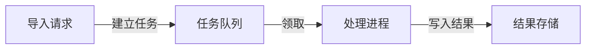

# 按用途选择和维护项目资料

仅在需要选择表达形式、建立知识关系或同步派生资料时参考。例子是取舍依据，不是项目必须创建的文件清单。

## 先明确接手者要回答的问题

资料可以跨多个文件和格式，只要能支持理解与行动。优先沿用已有入口、工具和维护方式；不强制 Markdown、Wiki 平台、地图工具或目录结构。产物保留在项目或用户指定的资料位置，使后续人和 Agent 无需依赖本轮聊天或插件缓存就能使用。

| 当前困难 | 可选表达 | 何时不必增加 |
| --- | --- | --- |
| 不知道怎么启动、配置或排错 | 简短说明、命令、输入输出示例 | 现有指南或可执行示例已能直接回答 |
| 难以理解模块协作、状态或数据流 | 架构图、流程图、时序图 | 一段说明已足够，或关系尚无依据 |
| 不知道为什么这样设计、能否换方案 | 在相关方案旁保留决定、理由与适用条件 | 理由显而易见且不会影响后续选择 |
| 主题多、关系难查，目录不能表达含义 | 相互链接的 Wiki 页面、知识地图 | 文件少、线性入口已足够，或只是想把目录画成图 |
| 需要确认界面或运行现象 | 截图、录屏、运行产物与必要说明 | 文字证据已足够；不能用旧画面证明新版本 |
| 不知道当前任务从哪里继续 | 短快照与必要资料定位 | 原任务入口已准确，现场可以便宜恢复 |

## 同一事实如何有多种表达

每项重要事实明确主要维护位置；它可以是说明、图的源文件、结构化数据或现有外部资料，并不要求所有事实进入同一个大文件。其他视图可生成或提供带来源的摘要，不能成为需要独立手改的平行答案。

- 重要结论标明足够查证的来源，区分用户决定、验证事实与推测。来源可以是相对路径和符号、提交、用户已确认的决定或现有证据；不复制整个过程，也不强制每句话填写元数据。
- 保留仍影响行动的理由及适用条件。用户否决自动重试是因为可能重复扣费，这个原因在风险仍存在时值得保留；普通测试输出已经可靠保存时，定位通常足够。
- 图表保留可编辑源或生成数据。已有生成方式时沿用；手工编辑的 SVG 或绘图源也可作为主要资料，不必另建一份数据模型。
- 知识地图节点应定位实际主题、代码或证据，边表达有意义且可核对的关系，例如“依赖”“受此约束”“验证了”。不从同目录或名称相似推断关系，不把未验证关系画成确定事实。
- 内容变化时先判断影响，更新主要资料和相关派生视图。文件时间或哈希变化仅提示复核；不自动断定说明失效，也不因一次修改全量重建知识库。
- 不能立即更新的视图标清失效部分与可用来源；属于当前交付要求时仍是待完成项。新快照或新图片不能冒充已经重新验证的事实。

## 三个取舍例子

**小工具已有完整说明。** README 包含运行命令、输入输出和限制。接手者能直接使用，就保持不变；无需再生成项目地图或“无需修改”的报告。

**流程关系妨碍接手。** 用户想理解异步导入。核对相关入口后，可以在现有说明中放一张图，让它解释经过查证的流程，而不是列出全部文件：

这是示意结构，不是项目事实。实际使用时以项目名称和已核对关系替换，在附近给出实现、重要约束与证据定位；无法证实的关系保持待核对。图源可直接嵌入现有说明，不强制导出图片或搭建网站。

**实现变化影响多个入口。** 批处理替代逐条请求，使用说明、流程图和相关 Wiki 页都展示旧流程。更新主要说明和图源，重建或修正引用它们的展示版本；保留仍有效的验收与选择批处理的理由。索引只负责导航，State 只保留尚未完成的现场，不复制整套资料。

## 完成意味着能使用、能继续维护

从接手者的当前问题出发，确认目标、关键关系、选择理由、可信状态和下一步能被找到；不要求每次覆盖这五项全部内容。图表要查看实际呈现，地图要核对有用的节点与关系，主要资料与派生视图保持一致。无法查看或验证时说明具体缺口。

只有反复出现且机械化有收益的步骤才值得加入脚本；先用现有能力完成任务。图或 Wiki 本身不要求引入专用服务、搜索数据库或后台同步。没有新事实或理解障碍时不改写，不以更短、更漂亮或新增更多材料作为成功证据。
